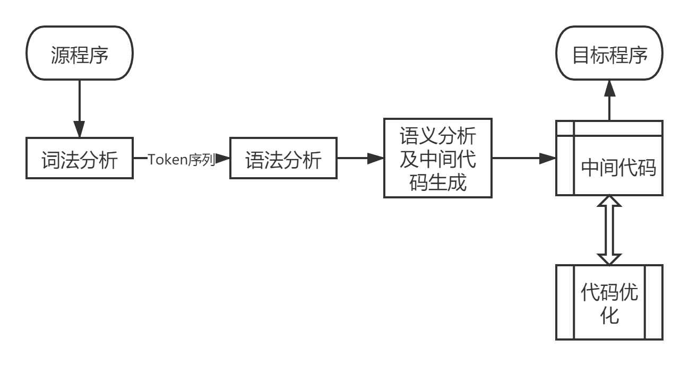
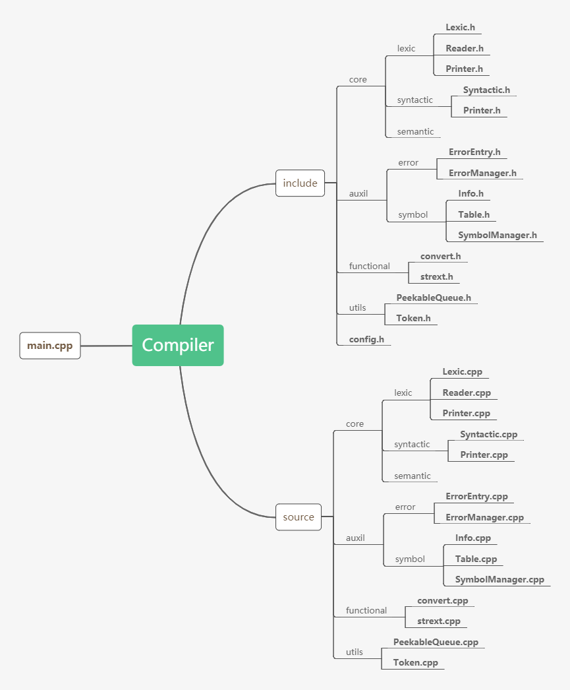
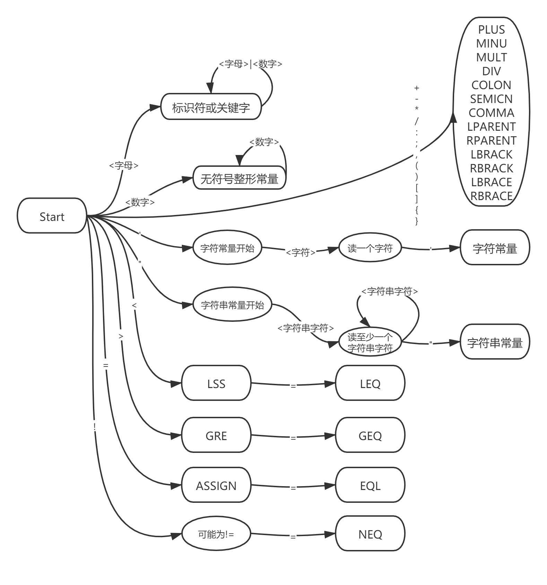

# 编译器设计文档

## 需求分析

编译器功能为将**类C语言高级程序设计语言的源程序**转化为**MIPS体系结构下的汇编目标程序**。

## 架构设计

### 数据流

此编译器采用多遍的设计思想，尽可能地将编译器五大阶段分离，其中优化部分也计划采用多遍优化地方案，整体架构如下



### 项目结构

将工程文件结构主要分为include和source部分，分别代表头文件及源代码文件，将两者分离便于编译器软件的发布和整理；具体地来看，将整个流程分为三大部分core auxil utils，分别代表编译器核心部分、辅助结构、工具函数文件，具体用加黑粗体表示文件。

此外，整个工程被分为多个命名空间，以便于相似结构部分的内容设计能够采用相同的命名，更加简洁清晰。

特别地，**整个工程项目的参数控制通过include-config.h进行控制，便于管理和部分功能的开关**。



## 各部分设计

### 词法分析部分

#### 输入输出

该部分的输入文件为高级语言程序，输出文件为如下定义的二元组列表
$$
(TokenCode, TokenValue)
$$

#### 二元组设计

| TokenCode | TokenValue(默认为大小写不敏感)                               |
| :-------: | ------------------------------------------------------------ |
|  IDENFR   | ＜字母＞｛＜字母＞｜＜数字＞｝                               |
|  INTCON   | ＜数字＞｛＜数字＞｝                                         |
|  CHARCON  | '＜加法运算符＞'｜'＜乘法运算符＞'｜'＜字母＞'｜'＜数字＞' **（大小写敏感）** |
|  STRCON   | "｛十进制编码为32,33,35-126的ASCII字符｝" **（大小写敏感）** |
|  CONSTTK  | const                                                        |
|   INTTK   | int                                                          |
|  CHARTK   | char                                                         |
|  VOIDTK   | void                                                         |
|  MAINTK   | main                                                         |
|   IFTK    | if                                                           |
|  ELSETK   | else                                                         |
| SWITCHTK  | switch                                                       |
|  CASETK   | case                                                         |
| DEFAULTTK | default                                                      |
|  WHILETK  | while                                                        |
|   FORTK   | for                                                          |
|  SCANFTK  | scanf                                                        |
| PRINTFTK  | printf                                                       |
| RETURNTK  | return                                                       |
|   PLUS    | +                                                            |
|   MINU    | -                                                            |
|   MULT    | *                                                            |
|    DIV    | /                                                            |
|    LSS    | <                                                            |
|    LEQ    | <=                                                           |
|    GRE    | >                                                            |
|    GEQ    | \>=                                                          |
|    EQL    | ==                                                           |
|    NEQ    | !=                                                           |
|   COLON   | :                                                            |
|  ASSIGN   | =                                                            |
|  SEMICN   | ;                                                            |
|   COMMA   | ,                                                            |
|  LPARENT  | (                                                            |
|  RPARENT  | )                                                            |
|  LBRACK   | [                                                            |
|  RBRACK   | ]                                                            |
|  LBRACE   | (                                                            |
|  RBRACE   | )                                                            |

#### 结构说明

##### Reader

专注于从输入文件读取文本，设立专用缓冲区，并进行$(row, column)$统计，便于后续错误处理程序的需要；除此之外，Reader类还需要对文件结束进行判断，停止文件读入操作并设置下一个返回字符为$EOF$，便于词法分析主程序判断读入结束。

```c++
class Reader
    {
    private:
        std::ifstream fsIn;
        queue<char> buffer;
        int row;
        int column;

    public:
        Reader(const string& fIn);
        ~Reader();

    public:
        char next();
        int getRow() const;
        int getColumn() const;
    };
```

##### Printer

专注于输出文件的操作，被调用时接受二元组$(TokenCode, TokenValue)$，输出到词法分析阶段的调试输出文件；其中通过$enabled$开关控制是否进行中间二元组序列调试文件的输出与否。

```c++
class Printer
    {
    private:
        const bool enabled = config::PRINT_LEXIC;
        std::ofstream fsOut;

    public:
        Printer(const string& fOut);
        ~Printer();

    public:
        void print(const config::TokenCode tkcode, const string& tkvalue);
    };
```

##### Lexic

此为词法分析阶段的主类，其中设置全局的当前字符$ch$用于保存当前处理到的字符；整体结构如下所示，$parseTk()$返回值用于控制是否还能继续读入文本。

```c++
class Lexic
    {
    private:
        Reader* reader;
        Printer* printer;
        char ch;

    public:
        Lexic(const string& fIn, const string& fOut);
        ~Lexic();

    private:
        static bool _isBlank(const char& c);
        static bool _isLetter(const char& c);
        static bool _isDigit(const char& c);
        static bool _isCharLetter(const char& c);
        static bool _isStringLetter(const char& c);
        static bool _isReservedToken(const char* buffer);
        void _readNext();
        void _skipBlank();
        void _logtoken(const config::TokenCode& tkcode, const string& value);
        bool _parseTk();

    public:
        void run();
    };
```

词法分析部分的=入口函数定义为$run()$，具体实现和结束控制如下所示

```c++
void lexic::Lexic::run()
{
    while (_parseTk());
}
```

**核心部分为字符串识别自动机**，其中椭圆形状为单圈节点，圆矩形为双圈节点，双圈节点代表接受该字符串，得到识别。

### 语法分析部分

语法分析部分整体采用非回溯的递归下降子程序法进行，通过预读的方式进行，**LL(k)文法**

#### Token序列多遍传递数据结构

经过词法分析部分后，得到由Token及其值组成的序列，观察文法能够更发现其已经消除了左递归文法，但可能出现需要回溯递归下降，考虑通过预读多个Token进行分支的选择，避免回溯。

在词法分析和语法分析之间，通过一种数据结构进行中间表达形式的传递，定义抽象数据结构**PeekableQueue**，能够支持

- push(Token), 向队列尾部添加一个元素
- peek(k), 查看队列首部第k个元素，但并不对原队列进行任何修改，并且如果元素个数不足k个则直接以空Token EMPTY作为结果
- pop(k), 弹出队列首部的k个元素，不足k个则以实际个数为准

数据结构的代码形式声明如下：

``` cpp
class PeekableQueue
{
private:
    vector<Token> queue;

public:
    PeekableQueue();

public:
    void push(const Token& tkpair);
    Token peek(const int& k = 1) const;
    void pop(const int& k = 1);
};
```

#### 基于预读的递归下降子程序法

##### 预读情况分支选择表

为方便表述，这里用$token[i]$表示当前预读队列首开始的第$i$个Token, 在设计层面做如下分析

<table>
    <tr><th>层次</th><th>可选项</th><th>进入条件</th></tr>
    <tr><td rowspan=5>＜程序＞</td><td>［＜常量说明＞］</td><td>token[1]==CONSTTK</td></tr>
    <tr><td>［＜变量说明＞］</td><td>token[3]!=LPARENT</td></tr>
    <tr><td>{＜有返回值函数定义＞|＜无返回值函数定义＞}</td><td>token[2]!=MAINTK</td></tr>
    <tr><td>＜有返回值函数定义＞</td><td>token[1]!=VOIDTK</td></tr>
    <tr><td>＜无返回值函数定义＞</td><td>token[1]==VOIDTK</td></tr>
    <tr><td rowspan=1>＜常量说明＞</td><td>const＜常量定义＞;</td><td>循环条件token[1]==CONSTTK</td></tr>
    <tr><td rowspan=1>＜变量说明＞</td><td>＜变量定义＞;</td><td>循环条件token[1]==INTTK|CHARTK and token[2]==IDENFR and token[3]!=LPARENT</td></tr>
    <tr><td rowspan=1>＜主函数＞</td><td>void main‘(’‘)’ ‘{’＜复合语句＞‘}’</td><td>TRUE</td></tr>
    <tr><td rowspan=1>＜有返回值函数定义＞</td><td>＜声明头部＞'('＜参数表＞')' '{'＜复合语句＞'}'</td><td>TRUE</td></tr>
    <tr><td rowspan=1>＜无返回值函数定义＞</td><td>void＜标识符＞'('＜参数表＞')''{'＜复合语句＞'}'</td><td>TRUE</td></tr>
    <tr><td rowspan=1>＜有返回值函数调用语句＞</td><td>＜标识符＞'('＜值参数表＞')'</td><td>TRUE</td></tr>
    <tr><td rowspan=1>＜无返回值函数调用语句＞</td><td>＜标识符＞'('＜值参数表＞')'</td><td>TRUE</td></tr>
    <tr><td rowspan=2>＜声明头部＞</td><td>int＜标识符＞</td><td>token[1]==INTTK</td></tr>
    <tr><td>char＜标识符＞</td><td>token[1]==CHARTK</td></tr>
    <tr><td rowspan=2>＜复合语句</td><td>［＜常量说明＞］</td><td>token[1]==CONSTTK</td></tr>
    <tr><td>［＜变量说明＞］</td><td>token[1]==INTTK|CHARTK</td></tr>
    <tr><td rowspan=1>＜语句列＞</td><td>＜语句＞</td><td>循环条件token[1]!=RBRACE</td></tr>
    <tr><td rowspan=13>＜语句＞</td><td>＜空＞;</td><td>token[1]==SEMICN</td></tr>
    <tr><td>'{'＜语句列＞'}'</td><td>token[1]==LBRACE</td></tr>
    <tr><td>＜循环语句＞</td><td>token[1]==FORTK|WHILETK</td></tr>
    <tr><td>＜条件语句＞</td><td>token[1]==IFTK</td></tr>
    <tr><td>＜读语句＞;</td><td>token[1]==SCANFTK</td></tr>
    <tr><td>＜写语句＞;</td><td>token[1]==PRINTFTK</td></tr>
    <tr><td>＜返回语句＞;</td><td>token[1]==RETURNTK</td></tr>
    <tr><td>＜情况语句＞</td><td>token[1]==SWITCHTK</td></tr>
    <tr><td>＜有返回值函数调用语句＞; | ＜无返回值函数调用语句＞; | ＜赋值语句＞;</td><td>token[1]==IDENFR</td></tr>
    <tr><td>＜有返回值函数调用语句＞ | ＜无返回值函数调用语句＞</td><td>token[2]==LPARENT</td></tr>
    <tr><td>＜赋值语句＞</td><td>token[2]!=LPARENT</td></tr>
    <tr><td>＜有返回值函数调用语句＞</td><td>符号表记录标识符为有返回值类型</td></tr>
    <tr><td>＜无返回值函数调用语句＞</td><td>符号表记录标识符为无返回值类型</td></tr>
    <tr><td rowspan=3>＜赋值语句＞</td><td>＜标识符＞＝＜表达式＞</td><td>token[2]!=LBRACK</td></tr>
    <tr><td>＜标识符＞'['＜表达式＞']'=＜表达式＞</td><td>token[2]==LBRACK and token[5]!=LBRACK</td></tr>
    <tr><td>＜标识符＞'['＜表达式＞']''['＜表达式＞']' =＜表达式＞</td><td>token[2]==LBRACK and token[5]==LBRACK</td></tr>
    <tr><td rowspan=1>＜条件语句＞</td><td>[else＜语句＞]</td><td>token[1]==ELSETK</td></tr>
    <tr><td rowspan=2>＜循环语句＞</td><td>while '('＜条件＞')'＜语句＞</td><td>token[1]==WHILETK</td></tr>
    <tr><td>for'('＜标识符＞＝＜表达式＞;＜条件＞;＜标识符＞＝＜标识符＞(+|-)＜步长＞')'＜语句＞</td><td>token[1]==FORTK</td></tr>
    <tr><td rowspan=1>＜读语句＞</td><td>scanf '('＜标识符＞')' </td><td>token[1]==SCANFTK</td></tr>
    <tr><td rowspan=3>＜写语句＞</td><td> printf '(' ＜字符串＞,＜表达式＞ ')'</td><td>token[3]==STRCON and token[4]==COMMA</td></tr>
    <tr><td>printf '('＜字符串＞ ')'</td><td>token[3]==STRCON and token[4]!=COMMA</td></tr>
    <tr><td>printf '('＜表达式＞')'</td><td>token[3]!=STRCON</td></tr>
    <tr><td rowspan=1>＜情况语句＞</td><td>switch ‘(’＜表达式＞‘)’ ‘{’＜情况表＞＜缺省＞‘}</td><td>TRUE</td></tr>
    <tr><td rowspan=2>＜返回语句＞</td><td>return['('＜表达式＞')']</td><td>token[2]==LPARENT</td></tr>
    <tr><td>return</td><td>token[2]!=LPARENT</td></tr>
    <tr><td rowspan=2>＜表达式＞</td><td>［＋｜－］</td><td>token[1]==PLUS|MINU</td></tr>
    <tr><td>{＜加法运算符＞＜项＞}</td><td>循环条件token[1]==PLUS|MINU</td></tr>
    <tr><td rowspan=1>＜项＞</td><td>＜乘法运算符＞＜因子＞</td><td>循环条件token[1]==MULT|DIV</td></tr>
    <tr><td rowspan=9>＜因子＞</td><td>＜字符＞</td><td>token[1]==CHARCON</td></tr>
    <tr><td>＜整数＞</td><td>token[1]==PLUS|MINU|INTCON</td></tr>
    <tr><td>'('＜表达式＞')'</td><td>token[1]==LPARENT</td></tr>
    <tr><td>＜标识符＞ ｜ ＜标识符＞'['＜表达式＞']' | ＜标识符＞'['＜表达式＞']''['＜表达式＞']' | ＜有返回值函数调用语句＞</td><td>token[1]==IDENFR</td></tr>
    <tr><td>＜有返回值函数调用语句＞</td><td>token[2]==LPARENT</td></tr>
    <tr><td>＜标识符＞ ｜ ＜标识符＞'['＜表达式＞']' | ＜标识符＞'['＜表达式＞']''['＜表达式＞']'</td><td>token[1]!=IDENFR</td></tr>
    <tr><td>＜标识符＞</td><td>token[2]!=LBRACK</td></tr>
    <tr><td>＜标识符＞'['＜表达式＞']'</td><td>token[2]==LBRACK and token[5]!=LBRACK</td></tr>
    <tr><td>＜标识符＞'['＜表达式＞']''['＜表达式＞']'</td><td>token[2]==LBRACK and token[5]==LBRACK</td></tr>
    <tr><td rowspan=3>＜参数表＞</td><td>＜空＞</td><td>token[1]!=INTTK and token[1]!=CHARTK</td></tr>
    <tr><td>＜类型标识符＞＜标识符＞{,＜类型标识符＞＜标识符＞}</td><td>token[1]==INTTK|CHARTK</td></tr>
    <tr><td>{,＜类型标识符＞＜标识符＞}</td><td>循环条件token[1]==COMMA</td></tr>
    <tr><td rowspan=3>＜值参数表＞</td><td>＜空＞</td><td>token[1]==RPARENT</td></tr>
    <tr><td>＜表达式＞{,＜表达式＞}</td><td>token[1]!=RPARENT</td></tr>
    <tr><td>{,＜表达式＞}</td><td>循环条件token[1]==COMMA</td></tr>
    <tr><td rowspan=1>＜情况表＞</td><td>{＜情况子语句＞} </td><td>循环条件token[1]==CASETK</td></tr>
    <tr><td rowspan=1>＜情况子语句＞</td><td>case＜常量＞：＜语句＞</td><td>TRUE</td></tr>
    <tr><td rowspan=1>＜缺省＞</td><td>default :＜语句＞</td><td>TRUE</td></tr>
    <tr><td rowspan=1>＜条件＞</td><td>＜表达式＞＜关系运算符＞＜表达式＞</td><td>TRUE</td></tr>
    <tr><td rowspan=1>＜步长＞</td><td>＜无符号整数＞</td><td>TRUE</td></tr>
    <tr><td rowspan=4>＜常量定义＞</td><td>int＜标识符＞＝＜整数＞{,＜标识符＞＝＜整数＞}</td><td>token[1]==INTTK</td></tr>
    <tr><td>char＜标识符＞＝＜字符＞{,＜标识符＞＝＜字符＞}</td><td>token[1]==CHARTK</td></tr>
    <tr><td>{,＜标识符＞＝＜整数＞}</td><td>循环条件token[1]==COMMA</td></tr>
    <tr><td>{,＜标识符＞＝＜字符＞}</td><td>循环条件token[1]==COMMA</td></tr>
    <tr><td rowspan=4>＜变量定义无初始化＞</td><td>{,(＜标识符＞|＜标识符＞'['＜无符号整数＞']'|＜标识符＞'['＜无符号整数＞']''['＜无符号整数＞']')}</td><td>循环条件token[1]==COMMA</td></tr>
    <tr><td>＜标识符＞</td><td>token[2]!=LBRACK</td></tr>
    <tr><td>＜标识符＞'['＜无符号整数＞']'</td><td>token[2]==LBRACK and token[5]!=LBRACK</td></tr>
    <tr><td>＜标识符＞'['＜无符号整数＞']''['＜无符号整数＞']'</td><td>token[2]==LBRACK and token[5]==LBRACK</td></tr>
    <tr><td rowspan=3>＜变量定义及初始化＞</td><td>＜类型标识符＞＜标识符＞=＜常量＞</td><td>token[3]!=LBRACK</td></tr>
    <tr><td>＜类型标识符＞＜标识符＞'['＜无符号整数＞']'='{'＜常量＞{,＜常量＞}'}'</td><td>token[3]==LBRACK and token[6]!=LBRACK</td></tr>
    <tr><td>＜类型标识符＞＜标识符＞'['＜无符号整数＞']''['＜无符号整数＞']'='{''{'＜常量＞{,＜常量＞}'}'{, '{'＜常量＞{,＜常量＞}'}'}'}'</td><td>token[3]==LBRACK and token[6]==LBRACK</td></tr>
    <tr><td rowspan=1>＜整数＞</td><td>［＋｜－］</td><td>token[1]==PLUS|MINU</td></tr>
    <tr><td rowspan=2>＜常量＞</td><td>＜字符＞</td><td>token[1]==CHARCON</td></tr>
    <tr><td>＜整数＞</td><td>token[1]!=CHARCON</td></tr>

##### 递归结构

通过递归调用，每一层次判断应该进入的分支，进行匹配，遇到非终结符号时，通过调用子处理程序进行递归处理。如下为语法分析主要部分：

```cpp
class Syntactic
    {
    private:
        PeekableQueue* queue;
        Printer* printer;
        symbol::SymbolManager* symbolManager;

    public:
        Syntactic(const string& fOut, PeekableQueue* _queue, symbol::SymbolManager* _symbolManager);
        ~Syntactic();

    private:
        Token _cur();
        void _next();
        void _printAndNext();
        bool _isComeFirstThan(const config::TokenCode& tkcode1, const config::TokenCode& tkcode2) const;

    public:
        void parseProgram();

    private:
        // Illustration
        void parseConstIllustration();
        void parseVarIllustration();
        // Function
        void parseMainFunction();
        void parseFunctionValuedDeclaration();
        void parseFunctionVoidDeclaration();
        void parseFunctionValuedCallStatement();
        void parseFunctionVoidCallStatement();
        void parseDeclarationHead(string& _idenfr);
        // Statement
        void parseCompoundStatement();
        void parseStatementList();
        void parseStatement();
        void parseAssignStatement();
        void parseConditionStatement();
        void parseLoopStatement();
        void parseWhileStatement();
        void parseForStatement();
        void parseReadStatement();
        void parsePrintStatement();
        void parseSwitchStatement();
        void parseReturnStatement();
        // Expression
        void parseExpression();
        void parseTerm();
        void parseFactor();
        // Parameter
        void parseParameterDeclarationList();
        void parseParameterValueList();
        // Conditional component
        void parseCaseList();
        void parseCaseSubStatement();
        void parseDefault();
        void parseCondition();
        void parseStepLength(int& _step);
        // Const & Var
        void parseConstDeclaration();
        void parseVarDeclaration();
        void parseVarDeclarationUninitialized();
        void parseVarDeclarationInitialized();
        // Values
        void parseInteger(int& _integer);
        void parseUnsigned(int& _unsigned);
        void parseString(string& _str);
        void parseConstant(int& _value, bool& _isInteger);
    };
```

#### 符号表的初步设计

语法分析部分本应该为上下文无关文法，但涉及到如下语法时，无法单从预读的方式来判断应该选用哪个分支

```
＜有返回值函数调用语句＞ ::= ＜标识符＞'('＜值参数表＞')'         /*测试程序需出现有返回值的函数调用语句*/
＜无返回值函数调用语句＞ ::= ＜标识符＞'('＜值参数表＞')'         /*测试程序需出现无返回值的函数调用语句*/
```

因此一种方便的可扩展的解决方式为通过符号表对相应函数定义时候的标识符进行属性记录，在调用时查表可以知道应选用有返回值还是无返回值函数调用。

[具体符号表设计链接到后文](#SymbolManager)

### 语义分析部分

pass

### 目标代码生成部分

pass

### 优化整体架构

pass

### <span id="SymbolManager">符号表设计</span>

#### 动态子表结构

进入子结构（类C语言中目前只有函数和主函数需要）建立新的子表，执行定位和重定位操作，查表按照从里到外的顺序查表。

在编码后的具体实现上，通过SymbolManager类对整个符号表进行管理，用变量curTable标出当前所在子表层次，便于进行动态管理，如下为符号表的整体接口情况：

```cpp
class SymbolManager
    {
    private:
        vector<Table> tables;
        int curTable;

    public:
        SymbolManager();

    public:
        bool hasSymbolInScope(const string& symbol) const;
        bool hasSymbolInAll(const string& symbol) const;
        Info getInfoInAll(const string& symbol) const;
        bool declareSymbol(const string& symbol, const Info& info);
    };
```

#### 表内元素管理

使用挂链法的哈希表进行子表内部结构管理，通过标识符作为Key，能够对应唯一的属性信息Value。

在具体实现上，通过Table类进行子表管理，如下为相应接口：

```cpp
class Table
    {
    private:
        unordered_map<string, Info> data;

    public:
        Table();

    public:
        bool hasKey(const string& _key) const;
        Info getInfo(const string& key) const;
        bool insertRecord(const string& key, const Info& info);
    };
```

#### 属性信息

| 属性名称             | 属性意义                                                  |
| -------------------- | --------------------------------------------------------- |
| $symbolType$         | 区别CONST，VAR，FUNCTION三种符号类型                      |
| $dataType$           | 区别INT，CHAR，VOID三种取值类型                           |
| $arrayDim$           | 如果是非函数类型，表示数组维数，其中非数组标识为维数dim=0 |
| $dimLimit_{0,1}$     | 用于表示数组定义时相应维度定义的长度                      |
| $declareRow$         | 标识符定义的时候对应的行数                                |
| $referRows_{\cdots}$ | 表示标识符引用的时候对应的行数列表                        |
| $address$            | 用于表示分配的内存地址，数组则是内存中的数组首地址        |

具体实现上，由于符号表Entry属性的填充是动态更新的，添加两个控制标签$ctrlDeclared$和$ctrlAddressed$分别表示该标识符是否已经完善了定义、该标识符是否已经进行了地址分配，并通过assert进行保护，避免意想不到的情况出现，声明结构如下：

```cpp
class Info
    {
    private:
        config::SymbolType symbolType;
        config::DataType dataType;
        uint arrayDim;
        uint dimLimit[2];
        uint declareRow;
        vector<uint> referRows;
        uint address;

    private:
        bool ctrlDeclared;
        bool ctrlAddressed;

    public:
        Info();
        Info(const config::SymbolType &_symbolType, const config::DataType &_dataType, const uint &_declareRow,
             const uint &_arrayDim = 0, const uint &_dim0 = 0, const uint &_dim1 = 0);

    public:
        void logReference(const uint& _row);
        void logAddress(const uint& _address);
        bool checkDeclared() const;
        bool checkAddressed() const;
        void assertDeclared() const;
        void assertAddressed() const;
        bool isFunction() const;
        bool isValuedFunction() const;
        bool isVoidFunction() const;
    };
```

## 优化方案

### Optim1

pass

### Optim2

pass