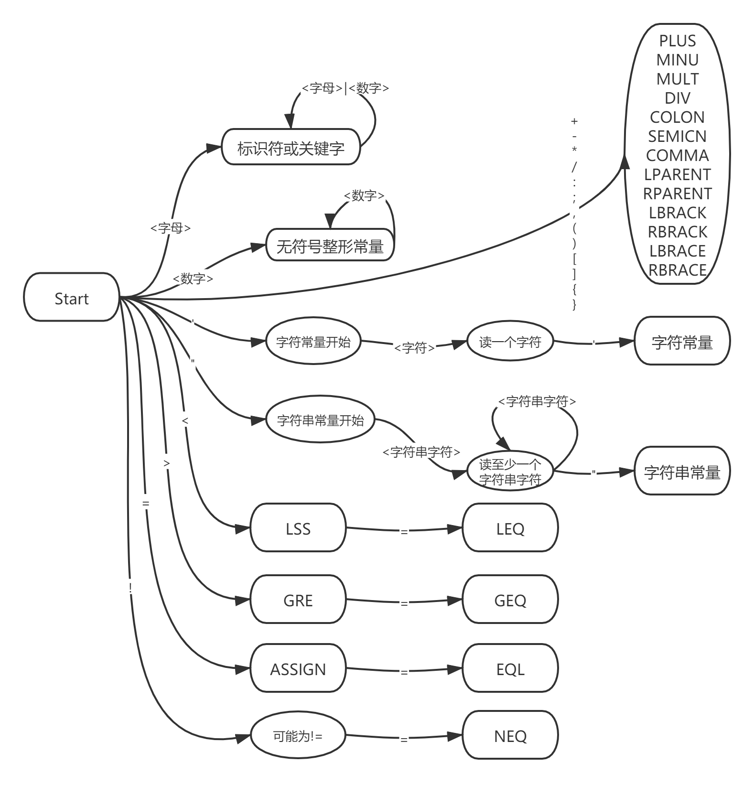
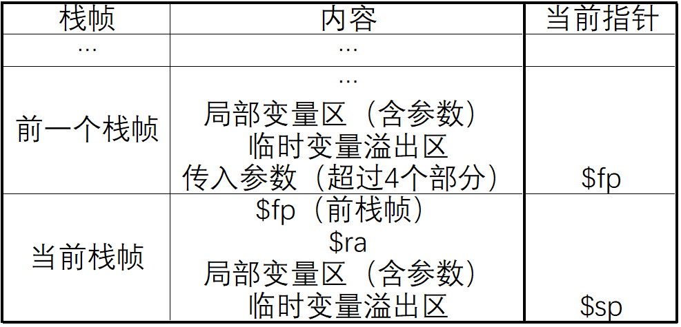

# 编译技术课程设计指导

## 写在前面

**无论在编译器设计的什么阶段，用于设计的精力一定要远大于编码的精力。**

## 架构设计

可以负责任地说，在整个编译课设过程中，我的代码没有任何规模超过10分钟的重构。在完成了整个编译器后回过头来看，主要原因可能是**在最开始做词法分析的时候便设计好了整个编译器前端的架构设计**，后续需要做的便是实现一个一个的子模块。

如下是我的编译器的整体架构，此编译器采用多遍的设计思想，尽可能地将编译器五大阶段分离，其中优化部分也计划采用多遍优化地方案，整体架构如下


将工程文件结构主要分为include和source部分，分别代表头文件及源代码文件，将两者分离便于编译器软件的发布和整理；具体地来看，将整个流程分为三大部分core auxil utils，分别代表编译器核心部分、辅助结构、工具函数文件，具体用加黑粗体表示文件。

此外，整个工程被分为多个命名空间，以便于相似结构部分的内容设计能够采用相同的命名，更加简洁清晰。

特别地，**整个工程项目的参数控制通过include-config.h进行控制，便于管理和部分功能的开关**。


## 各部分困难点及解决方案

### 词法分析部分

词法分析部分较为简单，做的只是些文本上的简单操作；在这部分主要的困难点在于Token个数的繁多，需要根据分类细致地进行编码工作。

一种较好的解决办法便是**做好充足的设计**，我的设计中明确地设计出了**识别Token的有穷状态自动机**，根据此进行编码能够做到不重不漏，分类明确。

#### 二元组设计

该部分的输入文件为高级语言程序，输出文件为如下定义的二元组列表
$$
(TokenCode, TokenValue)
$$

| TokenCode | TokenValue(默认为大小写不敏感)                               |
| :-------: | ------------------------------------------------------------ |
|  IDENFR   | ＜字母＞｛＜字母＞｜＜数字＞｝                               |
|  INTCON   | ＜数字＞｛＜数字＞｝                                         |
|  CHARCON  | '＜加法运算符＞'｜'＜乘法运算符＞'｜'＜字母＞'｜'＜数字＞' **（大小写敏感）** |
|  STRCON   | "｛十进制编码为32,33,35-126的ASCII字符｝" **（大小写敏感）** |
|  CONSTTK  | const                                                        |
|   INTTK   | int                                                          |
|  CHARTK   | char                                                         |
|  VOIDTK   | void                                                         |
|  MAINTK   | main                                                         |
|   IFTK    | if                                                           |
|  ELSETK   | else                                                         |
| SWITCHTK  | switch                                                       |
|  CASETK   | case                                                         |
| DEFAULTTK | default                                                      |
|  WHILETK  | while                                                        |
|   FORTK   | for                                                          |
|  SCANFTK  | scanf                                                        |
| PRINTFTK  | printf                                                       |
| RETURNTK  | return                                                       |
|   PLUS    | +                                                            |
|   MINU    | -                                                            |
|   MULT    | *                                                            |
|    DIV    | /                                                            |
|    LSS    | <                                                            |
|    LEQ    | <=                                                           |
|    GRE    | >                                                            |
|    GEQ    | \>=                                                          |
|    EQL    | ==                                                           |
|    NEQ    | !=                                                           |
|   COLON   | :                                                            |
|  ASSIGN   | =                                                            |
|  SEMICN   | ;                                                            |
|   COMMA   | ,                                                            |
|  LPARENT  | (                                                            |
|  RPARENT  | )                                                            |
|  LBRACK   | [                                                            |
|  RBRACK   | ]                                                            |
|  LBRACE   | (                                                            |
|  RBRACE   | )                                                            |

**核心部分为字符串识别自动机**，其中椭圆形状为单圈节点，圆矩形为双圈节点，双圈节点代表接受该字符串，得到识别。

### 语法分析部分

语法分析部分按照老师课上讲的按部就班实现就行，整体采用非回溯的递归下降子程序法进行。

主要的困难点在于课程组给的文法不是一个LL(1)文法，因此在分支的选择上并不是显而易见的。仔细观察后发现，文法虽然只通过预读1个Token不能有效判断，但是文法是一个无二义性的非左递归文法，这一点让我们想到唯一需要解决的问题便是分支选择问题，下面分析如何解决这个问题：

#### Token序列多遍传递数据结构

经过词法分析部分后，得到由Token及其值组成的序列，观察文法能够更发现其已经消除了左递归文法，但可能出现需要回溯递归下降，考虑通过预读多个Token进行分支的选择，避免回溯。

在词法分析和语法分析之间，通过一种数据结构进行中间表达形式的传递，定义抽象数据结构**PeekableQueue**，能够支持

- push(Token), 向队列尾部添加一个元素
- peek(k), 查看队列首部第k个元素，但并不对原队列进行任何修改，并且如果元素个数不足k个则直接以空Token EMPTY作为结果
- pop(k), 弹出队列首部的k个元素，不足k个则以实际个数为准

#### 基于预读的递归下降子程序法

##### 预读情况分支选择表

为方便表述，这里用$token[i]$表示当前预读队列首开始的第$i$个Token, 在设计层面做如下分析，每一个层次都是一个子程序，“进入条件”中给出了当前子程序进行选择的条件，用这样的可变预读方法能够很好地解决分支选择问题。

<table>
    <tr><th>层次</th><th>可选项</th><th>进入条件</th></tr>
    <tr><td rowspan=5>＜程序＞</td><td>［＜常量说明＞］</td><td>token[1]==CONSTTK</td></tr>
    <tr><td>［＜变量说明＞］</td><td>token[3]!=LPARENT</td></tr>
    <tr><td>{＜有返回值函数定义＞|＜无返回值函数定义＞}</td><td>token[2]!=MAINTK</td></tr>
    <tr><td>＜有返回值函数定义＞</td><td>token[1]!=VOIDTK</td></tr>
    <tr><td>＜无返回值函数定义＞</td><td>token[1]==VOIDTK</td></tr>
    <tr><td rowspan=1>＜常量说明＞</td><td>const＜常量定义＞;</td><td>循环条件token[1]==CONSTTK</td></tr>
    <tr><td rowspan=1>＜变量说明＞</td><td>＜变量定义＞;</td><td>循环条件token[1]==INTTK|CHARTK and token[2]==IDENFR and token[3]!=LPARENT</td></tr>
    <tr><td rowspan=1>＜主函数＞</td><td>void main‘(’‘)’ ‘{’＜复合语句＞‘}’</td><td>TRUE</td></tr>
    <tr><td rowspan=1>＜有返回值函数定义＞</td><td>＜声明头部＞'('＜参数表＞')' '{'＜复合语句＞'}'</td><td>TRUE</td></tr>
    <tr><td rowspan=1>＜无返回值函数定义＞</td><td>void＜标识符＞'('＜参数表＞')''{'＜复合语句＞'}'</td><td>TRUE</td></tr>
    <tr><td rowspan=1>＜有返回值函数调用语句＞</td><td>＜标识符＞'('＜值参数表＞')'</td><td>TRUE</td></tr>
    <tr><td rowspan=1>＜无返回值函数调用语句＞</td><td>＜标识符＞'('＜值参数表＞')'</td><td>TRUE</td></tr>
    <tr><td rowspan=2>＜声明头部＞</td><td>int＜标识符＞</td><td>token[1]==INTTK</td></tr>
    <tr><td>char＜标识符＞</td><td>token[1]==CHARTK</td></tr>
    <tr><td rowspan=2>＜复合语句</td><td>［＜常量说明＞］</td><td>token[1]==CONSTTK</td></tr>
    <tr><td>［＜变量说明＞］</td><td>token[1]==INTTK|CHARTK</td></tr>
    <tr><td rowspan=1>＜语句列＞</td><td>＜语句＞</td><td>循环条件token[1]!=RBRACE</td></tr>
    <tr><td rowspan=13>＜语句＞</td><td>＜空＞;</td><td>token[1]==SEMICN</td></tr>
    <tr><td>'{'＜语句列＞'}'</td><td>token[1]==LBRACE</td></tr>
    <tr><td>＜循环语句＞</td><td>token[1]==FORTK|WHILETK</td></tr>
    <tr><td>＜条件语句＞</td><td>token[1]==IFTK</td></tr>
    <tr><td>＜读语句＞;</td><td>token[1]==SCANFTK</td></tr>
    <tr><td>＜写语句＞;</td><td>token[1]==PRINTFTK</td></tr>
    <tr><td>＜返回语句＞;</td><td>token[1]==RETURNTK</td></tr>
    <tr><td>＜情况语句＞</td><td>token[1]==SWITCHTK</td></tr>
    <tr><td>＜有返回值函数调用语句＞; | ＜无返回值函数调用语句＞; | ＜赋值语句＞;</td><td>token[1]==IDENFR</td></tr>
    <tr><td>＜有返回值函数调用语句＞ | ＜无返回值函数调用语句＞</td><td>token[2]==LPARENT</td></tr>
    <tr><td>＜赋值语句＞</td><td>token[2]!=LPARENT</td></tr>
    <tr><td>＜有返回值函数调用语句＞</td><td>符号表记录标识符为有返回值类型</td></tr>
    <tr><td>＜无返回值函数调用语句＞</td><td>符号表记录标识符为无返回值类型</td></tr>
    <tr><td rowspan=3>＜赋值语句＞</td><td>＜标识符＞＝＜表达式＞</td><td>token[2]!=LBRACK</td></tr>
    <tr><td>＜标识符＞'['＜表达式＞']'=＜表达式＞</td><td>token[2]==LBRACK and token[5]!=LBRACK</td></tr>
    <tr><td>＜标识符＞'['＜表达式＞']''['＜表达式＞']' =＜表达式＞</td><td>token[2]==LBRACK and token[5]==LBRACK</td></tr>
    <tr><td rowspan=1>＜条件语句＞</td><td>[else＜语句＞]</td><td>token[1]==ELSETK</td></tr>
    <tr><td rowspan=2>＜循环语句＞</td><td>while '('＜条件＞')'＜语句＞</td><td>token[1]==WHILETK</td></tr>
    <tr><td>for'('＜标识符＞＝＜表达式＞;＜条件＞;＜标识符＞＝＜标识符＞(+|-)＜步长＞')'＜语句＞</td><td>token[1]==FORTK</td></tr>
    <tr><td rowspan=1>＜读语句＞</td><td>scanf '('＜标识符＞')' </td><td>token[1]==SCANFTK</td></tr>
    <tr><td rowspan=3>＜写语句＞</td><td> printf '(' ＜字符串＞,＜表达式＞ ')'</td><td>token[3]==STRCON and token[4]==COMMA</td></tr>
    <tr><td>printf '('＜字符串＞ ')'</td><td>token[3]==STRCON and token[4]!=COMMA</td></tr>
    <tr><td>printf '('＜表达式＞')'</td><td>token[3]!=STRCON</td></tr>
    <tr><td rowspan=1>＜情况语句＞</td><td>switch ‘(’＜表达式＞‘)’ ‘{’＜情况表＞＜缺省＞‘}</td><td>TRUE</td></tr>
    <tr><td rowspan=2>＜返回语句＞</td><td>return['('＜表达式＞')']</td><td>token[2]==LPARENT</td></tr>
    <tr><td>return</td><td>token[2]!=LPARENT</td></tr>
    <tr><td rowspan=2>＜表达式＞</td><td>［＋｜－］</td><td>token[1]==PLUS|MINU</td></tr>
    <tr><td>{＜加法运算符＞＜项＞}</td><td>循环条件token[1]==PLUS|MINU</td></tr>
    <tr><td rowspan=1>＜项＞</td><td>＜乘法运算符＞＜因子＞</td><td>循环条件token[1]==MULT|DIV</td></tr>
    <tr><td rowspan=9>＜因子＞</td><td>＜字符＞</td><td>token[1]==CHARCON</td></tr>
    <tr><td>＜整数＞</td><td>token[1]==PLUS|MINU|INTCON</td></tr>
    <tr><td>'('＜表达式＞')'</td><td>token[1]==LPARENT</td></tr>
    <tr><td>＜标识符＞ ｜ ＜标识符＞'['＜表达式＞']' | ＜标识符＞'['＜表达式＞']''['＜表达式＞']' | ＜有返回值函数调用语句＞</td><td>token[1]==IDENFR</td></tr>
    <tr><td>＜有返回值函数调用语句＞</td><td>token[2]==LPARENT</td></tr>
    <tr><td>＜标识符＞ ｜ ＜标识符＞'['＜表达式＞']' | ＜标识符＞'['＜表达式＞']''['＜表达式＞']'</td><td>token[1]!=IDENFR</td></tr>
    <tr><td>＜标识符＞</td><td>token[2]!=LBRACK</td></tr>
    <tr><td>＜标识符＞'['＜表达式＞']'</td><td>token[2]==LBRACK and token[5]!=LBRACK</td></tr>
    <tr><td>＜标识符＞'['＜表达式＞']''['＜表达式＞']'</td><td>token[2]==LBRACK and token[5]==LBRACK</td></tr>
    <tr><td rowspan=3>＜参数表＞</td><td>＜空＞</td><td>token[1]!=INTTK and token[1]!=CHARTK</td></tr>
    <tr><td>＜类型标识符＞＜标识符＞{,＜类型标识符＞＜标识符＞}</td><td>token[1]==INTTK|CHARTK</td></tr>
    <tr><td>{,＜类型标识符＞＜标识符＞}</td><td>循环条件token[1]==COMMA</td></tr>
    <tr><td rowspan=3>＜值参数表＞</td><td>＜空＞</td><td>token[1]==RPARENT</td></tr>
    <tr><td>＜表达式＞{,＜表达式＞}</td><td>token[1]!=RPARENT</td></tr>
    <tr><td>{,＜表达式＞}</td><td>循环条件token[1]==COMMA</td></tr>
    <tr><td rowspan=1>＜情况表＞</td><td>{＜情况子语句＞} </td><td>循环条件token[1]==CASETK</td></tr>
    <tr><td rowspan=1>＜情况子语句＞</td><td>case＜常量＞：＜语句＞</td><td>TRUE</td></tr>
    <tr><td rowspan=1>＜缺省＞</td><td>default :＜语句＞</td><td>TRUE</td></tr>
    <tr><td rowspan=1>＜条件＞</td><td>＜表达式＞＜关系运算符＞＜表达式＞</td><td>TRUE</td></tr>
    <tr><td rowspan=1>＜步长＞</td><td>＜无符号整数＞</td><td>TRUE</td></tr>
    <tr><td rowspan=4>＜常量定义＞</td><td>int＜标识符＞＝＜整数＞{,＜标识符＞＝＜整数＞}</td><td>token[1]==INTTK</td></tr>
    <tr><td>char＜标识符＞＝＜字符＞{,＜标识符＞＝＜字符＞}</td><td>token[1]==CHARTK</td></tr>
    <tr><td>{,＜标识符＞＝＜整数＞}</td><td>循环条件token[1]==COMMA</td></tr>
    <tr><td>{,＜标识符＞＝＜字符＞}</td><td>循环条件token[1]==COMMA</td></tr>
    <tr><td rowspan=4>＜变量定义无初始化＞</td><td>{,(＜标识符＞|＜标识符＞'['＜无符号整数＞']'|＜标识符＞'['＜无符号整数＞']''['＜无符号整数＞']')}</td><td>循环条件token[1]==COMMA</td></tr>
    <tr><td>＜标识符＞</td><td>token[2]!=LBRACK</td></tr>
    <tr><td>＜标识符＞'['＜无符号整数＞']'</td><td>token[2]==LBRACK and token[5]!=LBRACK</td></tr>
    <tr><td>＜标识符＞'['＜无符号整数＞']''['＜无符号整数＞']'</td><td>token[2]==LBRACK and token[5]==LBRACK</td></tr>
    <tr><td rowspan=3>＜变量定义及初始化＞</td><td>＜类型标识符＞＜标识符＞=＜常量＞</td><td>token[3]!=LBRACK</td></tr>
    <tr><td>＜类型标识符＞＜标识符＞'['＜无符号整数＞']'='{'＜常量＞{,＜常量＞}'}'</td><td>token[3]==LBRACK and token[6]!=LBRACK</td></tr>
    <tr><td>＜类型标识符＞＜标识符＞'['＜无符号整数＞']''['＜无符号整数＞']'='{''{'＜常量＞{,＜常量＞}'}'{, '{'＜常量＞{,＜常量＞}'}'}'}'</td><td>token[3]==LBRACK and token[6]==LBRACK</td></tr>
    <tr><td rowspan=1>＜整数＞</td><td>［＋｜－］</td><td>token[1]==PLUS|MINU</td></tr>
    <tr><td rowspan=2>＜常量＞</td><td>＜字符＞</td><td>token[1]==CHARCON</td></tr>
    <tr><td>＜整数＞</td><td>token[1]!=CHARCON</td></tr>
#### 特殊情况及解决方案

语法分析部分本应该为上下文无关文法，但涉及到如下语法时，无法单从预读的方式来判断应该选用哪个分支

```
＜有返回值函数调用语句＞ ::= ＜标识符＞'('＜值参数表＞')'         /*测试程序需出现有返回值的函数调用语句*/
＜无返回值函数调用语句＞ ::= ＜标识符＞'('＜值参数表＞')'         /*测试程序需出现无返回值的函数调用语句*/
```

一种方便的可扩展的解决方式为**通过符号表对相应函数定义时候的标识符进行属性记录**，**在调用时查表可以知道应选用有返回值还是无返回值函数调用**。

### <span id="SymbolManager">符号表设计</span>

符号表这部分内容书上讲的是整个编译前端都会使用，但就个人的实验经验来看，只在**语法分析中的有无返回值函数调用判断**和**语义分析**中使用符号表能够更加简洁；由于文法是一个非分程序结构的语言，只需要维护全局表和子程序符号表，但为了可扩展性，防止课程组猝不及防的需求变化（参考OO课），推荐采用如下设计思路：

#### 动态子表结构

进入子结构（类C语言中目前只有函数和主函数需要）建立新的子表，执行定位和重定位操作，查表按照从里到外的顺序查表，但是为了**实现更普遍的情况**，此**编译器的符号表采用支持分程序结构的符号表**设计思路，按照子表结构进行管理；查找时从里到外的作用域逐渐查找，直到找到标识符或者发现当前查询的标识符未定义为止；插入时总是插入到当前最内层的作用域对应的子表中。

#### 表内元素管理

对于每一个子表，使用挂链法的哈希表进行子表内部结构管理，以标识符作为Key，能够找到对应唯一的属性信息Value；每一次查找当前表内有无元素时，通过hash函数映射到bucket编号上， 查询目标bucket对应的链表中有无带查找元素，如果没有便是未找到；插入时同理。

#### 属性信息

##### 设计思路

通过名字可以找到唯一的一个属性信息结构，其中记录了如下字段和相应表示的信息，但需要注意的是属性的回填需求，很容易误操作符号表；针对此现象，我的解决方案是添加三个控制标签$ctrlDeclared$和$ctrlAddressed$和$ctrlParamListFilled$分别表示该标识符**是否已经完善了定义、该标识符是否已经进行了地址分配、该标识符是否回填了参数表的信息**，并通过手工assert断言进行保护，避免意想不到的情况出现。

| 属性名称                | 属性意义                                                     |
| ----------------------- | ------------------------------------------------------------ |
| $symbolType$            | 区别CONST，VAR，FUNCTION三种符号类型                         |
| $dataType$              | 区别INT，CHAR，VOID三种取值类型                              |
| $arrayDim$              | 如果是非函数类型，表示数组维数，其中非数组标识为维数dim=0    |
| $dimLimit_{0,1}$        | 用于表示数组定义时相应维度定义的长度，即数组模板信息         |
| $declareRow$            | 标识符定义的时候对应的行数                                   |
| $referRows_{\cdots}$    | 表示标识符引用的时候对应的行数列表                           |
| $funcParamDataTypeList$ | 如果当前信息记录的是函数，那么还需要记录函数参数表的个数和相应参数类型向量，个数通过向量长度确定 |

### 错误处理设计

错误处理这部分看似简单容易实现，实际上暗藏玄机，需要仔细对待；根据前文说到，我在一开始便设计好了整个前端的架构，所以在词法分析和语法分析中，我已经给错误处理留出了相应的接口，在这里只需要按照之前的TODO一个一个判断错误种类并编码实现即可。课程组给的错误类别比较大，为了测试需要，建议将每个大类划分为若干个直观的小类，测试时只需要覆盖性测试每个小类出现的情况，由于分类足够细，可以有充分的理由相信程序的鲁棒性。

#### 错误细分设计表

<table>
    <tr><th>Code</th><th>ErrorType</th><th>Description</th><th></th></tr>
    <tr><td rowspan=4>A</td><td>IllegalLetterChar</td><td>字符常量中出现非法字符</td></tr>
    <tr><td>IllegalLetterString</td><td>字符串中出现非法字符</td></tr>
    <tr><td>EmptyCharOrString</td><td>字符常量或字符串中为空</td></tr>
    <tr><td>CharLengthError</td><td>字符常量单引号中的字符个数超过1</td></tr>
    <tr><td rowspan=1>B</td><td>DuplicatedName</td><td>标识符重复定义</td></tr>
    <tr><td rowspan=1>C</td><td>UndefinedName</td><td>引用未定义的标识符</td></tr>
    <tr><td rowspan=1>D</td><td>FunctionParamCountMismatch</td><td>函数调用中传入参数的个数与函数模板中的个数不匹配</td></tr>
    <tr><td rowspan=1>E</td><td>FunctionParamTypeMismatch</td><td>函数调用中传入参数的类型存在与模板不匹配的情况</td></tr>
    <tr><td rowspan=1>F</td><td>IllegalTypeInCondition</td><td>条件中比较的两端类型存在非int的情况</td></tr>
    <tr><td rowspan=2>G</td><td>VoidFunctionWithParents</td><td>无返回值函数存在return ();的语句</td></tr>
    <tr><td>VoidFunctionWithValue</td><td>无返回值函数存在return(表达式);的语句</td></tr>
    <tr><td rowspan=4>H</td><td>ValuedFunctionWithoutReturn</td><td>有返回值函数中不存在return语句</td></tr>
    <tr><td>ValuedFunctionWithVoid</td><td>有返回值函数中存在return;的语句</td></tr>
    <tr><td>ValuedFunctionWithParents</td><td>有返回值函数中存在return();的语句</td></tr>
    <tr><td>ValuedFunctionReturnTypeMismatch</td><td>有返回值函数中存在返回值类型不匹配的return语句</td></tr>
    <tr><td rowspan=1>I</td><td>ArraySubIndexTypeNotInt</td><td>数组引用时下标不为int类型</td></tr>
    <tr><td rowspan=2>J</td><td>ModifyConstWithAssign</td><td>赋值语句中对常量标识符进行修改</td></tr>
    <tr><td>ModifyConstWithScanf</td><td>读语句中对常量标识符进行修改</td></tr>
    <tr><td rowspan=3>K</td><td>ExpectSemicnInStatementEnd</td><td>在七种语句结尾缺少;</td></tr>
    <tr><td>ExpectSemicnInFor</td><td>在for语句圆括号内缺少;</td></tr>
    <tr><td>ExpectSemicnAtConstVarDeclarationEnd</td><td>在常量定义或变量定义末尾处缺少;</td></tr>
    <tr><td rowspan=11>L</td><td>ExpectRParentAtFunctionCall</td><td>函数调用处缺少)</td></tr>
    <tr><td>ExpectRParentAtFunctionDeclaration</td><td>函数定义处缺少)</td></tr>
    <tr><td>ExpectRParentAtMain</td><td>Main函数定义处缺少)</td></tr>
    <tr><td>ExpectRParentAtExpression</td><td>在带括号表达式缺少中缺少右端的;</td></tr>
    <tr><td>ExpectRParentAtIf</td><td>在if括号内缺少右端;</td></tr>
    <tr><td>ExpectRParentAtWhile</td><td>在while括号内缺少右端;</td></tr>
    <tr><td>ExpectRParentAtFor</td><td>在for括号内缺少右端;</td></tr>
    <tr><td>ExpectRParentAtSwitch</td><td>在switch括号内缺少右端;</td></tr>
    <tr><td>ExpectRParentAtScanf</td><td>在scanf括号内缺少右端;</td></tr>
    <tr><td>ExpectRParentAtPrintf</td><td>在printf括号内缺少右端;</td></tr>
    <tr><td>ExpectRParentAtReturn</td><td>在return括号内缺少右端;</td></tr>
    <tr><td rowspan=3>M</td><td>ExpectRBrackAtArrayDeclaration</td><td>在数组定义时缺少某个右端]</td></tr>
    <tr><td>ExpectRBrackAtArrayUseInFactor</td><td>因子中在数组引用时缺少某个右端]</td></tr>
    <tr><td>ExpectRBrackAtArrayUseInAssignLeft</td><td>在赋值语句左端部分引用数组时缺少]</td></tr>
    <tr><td rowspan=1>N</td><td>ArrayInitMismatchWithTemplate</td><td>数组定义及初始化时初始化内容任一维度的元素个数不匹配或缺少某一维的元素</td></tr>
    <tr><td rowspan=2>O</td><td>ConstantTypeMismatchInVarDeclarationAndInit</td><td>变量定义及初始化中初始化的类型与赋值右端不匹配</td></tr>
    <tr><td>ConstantTypeMismatchInSwitchCase</td><td>switch选择的类型与case中常量类型不一致</td></tr>
    <tr><td rowspan=1>P</td><td>ExpectDefaultStatement</td><td>缺少缺省语句</td></tr>
</table>

#### 跳读设计表

出错时的错误局部化处理是一个有挑战性的问题，我的解决方案是课件上讲到的**skip-until**策略，具体的结束符需要仔细考虑，如下是词法分析和语法分析阶段的跳读分析表。跳读分为两个层次，分别为**词法分析时产生错误**和**语法分析阶段产生错误**，两者的跳读分别为字符级别的和Token级别的。

下面用None表示不需要跳读的情况。

##### 词法分析跳读分析表

| ErrorType           | SkipUntil (excusive of common stop chars) |
| ------------------- | ----------------------------------------- |
| IllegalLetterChar   | \'                                        |
| IllegalLetterString | \"                                        |
| EmptyCharOrString   | None                                      |
| CharLengthError     | \'                                        |

##### 语法分析跳读分析表

| ErrorType                                   | SkipUntil (exclusive of common stop words) |
| ------------------------------------------- | ------------------------------------------ |
| DuplicatedName                              | None                                       |
| UndefinedName                               | None                                       |
| FunctionParamCountMismatch(more)            | COMMA, RPARENT                             |
| FunctionParamCountMismatch(less)            | None                                       |
| FunctionParamTypeMismatch                   | COMMA, RPARENT                             |
| IllegalTypeInCondition                      | None                                       |
| VoidFunctionWithParents                     | None                                       |
| VoidFunctionWithValue                       | None                                       |
| ValuedFunctionWithoutReturn                 | None                                       |
| ValuedFunctionWithVoid                      | None                                       |
| ValuedFunctionWithParents                   | None                                       |
| ValuedFunctionReturnTypeMismatch            | None                                       |
| ArraySubIndexTypeNotInt                     | RBRACK                                     |
| ModifyConstWithAssign                       | None                                       |
| ModifyConstWithScanf                        | None                                       |
| ExpectSemicnInStatementEnd                  | None                                       |
| ExpectSemicnInFor                           | None                                       |
| ExpectSemicnAtConstVarDeclarationEnd        | None                                       |
| ExpectRParentAtFunctionCall                 | None                                       |
| ExpectRParentAtFunctionDeclaration          | None                                       |
| ExpectRParentAtMain                         | None                                       |
| ExpectRParentAtExpression                   | None                                       |
| ExpectRParentAtExpression                   | None                                       |
| ExpectRParentAtWhile                        | None                                       |
| ExpectRParentAtFor                          | None                                       |
| ExpectRParentAtSwitch                       | None                                       |
| ExpectRParentAtScanf                        | None                                       |
| ExpectRParentAtPrintf                       | None                                       |
| ExpectRParentAtReturn                       | None                                       |
| ExpectRBrackAtArrayDeclaration              | None                                       |
| ExpectRBrackAtArrayUseInFactor              | None                                       |
| ExpectRBrackAtArrayUseInAssignLeft          | None                                       |
| ArrayInitMismatchWithTemplate               | SEMICN                                     |
| ConstantTypeMismatchInVarDeclarationAndInit | None                                       |
| ConstantTypeMismatchInSwitchCase            | None                                       |
| ExpectDefaultStatement                      | None                                       |

### 语义分析与中间代码生成部分

在这部分中的主要困难点在于如何设计一个同时满足**容易通过属性翻译生成**和**便于优化的实现**以及**与目标代码有良好的对应关系**，我的解决方案如下：

#### 中间代码设计

采用如下的四元式中间代码，其中充分考虑到了翻译过程的简便性以及保留了部分能够直接映射到目标代码的中间代码，避免冗余的操作产生

| OP          | OUT        | INL  | INR  | Meanings                       | Example                   |
| ----------- | ---------- | ---- | ---- | ------------------------------ | ------------------------- |
| ADD_IR      | c          | a    | b    | 加法运算                       | c=a+b                     |
| MINUS_IR    | c          | a    | b    | 减法运算                       | c=a-b                     |
| MULT_IR     | c          | a    | b    | 乘法运算                       | c=a*b                     |
| DIV_IR      | c          | a    | b    | 除法运算                       | c=a/b                     |
| LOAD_IR     | c          | arr  | idx  | 取数组元素值                   | c=arr[idx]                |
| STORE_IR    | c          | arr  | idx  | 向数组元素赋值包括单变量初始化 | arr[idx]=c                |
| MOVE_IR     | b          | a    |      | 单变量赋值操作                 | b=a                       |
| BEQ_IR      | label      | exp1 | exp2 | 相等跳转                       | if exp1==exp2 goto label  |
| BNE_IR      | label      | exp1 | exp2 | 不等跳转                       | if exp1!=exp2 goto label  |
| BLE_IR      | label      | exp1 | exp2 | 小于等于跳转                   | if exp1<=exp2 goto lable  |
| BLT_IR      | label      | exp1 | exp2 | 小于跳转                       | if exp1<exp2 goto label   |
| JUMP_IR     | label      |      |      | 无条件跳转                     | jump label                |
| PARA_IR     | names      |      |      | 定义函数参数列表（#分隔参数）  | para #name1#name2         |
| PUSH_IR     | names      |      |      | 传入实参列表                   | push #name1#name2         |
| DEPUSH_IR   | paramcount |      |      | 弹栈参数个数占用空间           | depush 3                  |
| CALL_IR     | funcname   |      |      | 调用函数                       | call calc                 |
| RET_IR      | x          |      |      | 函数返回语句，空为无返回值     | ret x \| ret              |
| MOVRET_IR   | b          |      |      | 将函数返回值放入指定变量       | b = RET                   |
| READ_IR     | name       | type |      | 读入指定类型的变量             | read x int                |
| WRITE_IR    | name       | type |      | 输出指定类型的值               | write x char              |
| STRING_IR   | newname    |      |      | 输出字符串常量                 | STRING_IR \_\_String\_\_0 |
| SETLABEL_IR | label      |      |      | 设置标签label                  | label_0:                  |
| EXIT_IR     | exitLabel  |      |      | 主函数中退出整个程序           | exit exitLabel            |
|             |            |      |      |                                |                           |
|             |            |      |      |                                |                           |

#### 中间代码数据结构

如何通过中间代码进行优化的实现是一个很重要的问题，为了解决这个问题，需要设计一个良好的高效的中间代码存储结构，我采用 **程序 - 函数 - 基本块 - 中间代码** 的层次结构进行中间代码储存结构设计，其中**程序**记录了全局量和程序中的所有字符串以及包括main的若干个函数，**函数**则记录了参数表、函数名和基本块信息，**基本块**则由若干四元组中间代码组成。

##### 程序-MIR

顶层中间代码数据结构包含全局的常量、变量、待输出的字符串，以及若干函数单元。

中间代码最外层程序数据结构的设计包括**存储和添加信息与查询内容**等接口。

##### 函数-Proc

函数作为**程序**的子模块，对包括Main函数在内的函数进行管理，其中包括参数具体信息的记录、声明的局部变量的记录、以及根据记录完成的四元组序列生成基本块的功能。

在实现上，采用了在语义分析中直接把四元组插入到当前函数的四元组序列中，并在添加完毕后设置不可变标记，并生成相应的不可变基本块数据结构；同时包含输出整个函数的中间代码信息的接口。

##### 基本块-Block

程序由若干个基本块组成，基本块中由若干四元组序列组成，其中基本块中间不包含跳转到其他基本块的中间代码。

##### 四元组-Quad

四元组是最基本的中间代码单元，并且设计了输出中间代码的接口。

#### 中间代码生成

在语义分析单元中插入属性翻译模块，所有的中间代码生成通过操作该属性翻译单元的接口进行实现，并通过引入全局序号管理功能和递归录制功能来解决全局标识符的同步问题和分支语句的可变顺序代码生成问题，具体描述如下：

##### 全局序号管理功能

由于在中间代码生成的过程中，需要在全局层面上引入标签计数、临时变量计数、全局字符串计数等支持，因此在属性翻译模块中设计标签、临时变量和字符串的标识符生成功能。例如，程序中的第二个标签为**\_\_\_Label\_\_2**，第五个临时变量为**\_\_\_Temp\_\_5**，在需要时进行扩张后的标识符生成和管理。

##### 递归录制功能

在生成如**for**、**while**、**switch**等结构的中间代码时，涉及到将一部分分支的中间代码进行录制，并需要支持一整块中间代码的插入功能，例如，**switch**的生成中，通过对每个case和default分支的录制操作，能够对整个switch语句块进行全局的管理，合理调配生成的顺序以及标签的插入；同时，这种录制的策略便于后续优化的实现，包括改变while等语句块的翻译方法，减少1个跳转指令等优化。

需要注意的点在于递归录制的支持，例如在switch语句块内部嵌套了另一个switch语句块，直接通过**是否在录制**的记录并不能有效还原录制的中间代码，因此采用多层的记录方式，每次开始录制时都在中间代码块的记录栈中压入一个空的中间代码块，即开始一层新的中间代码录制，结束当前层次的录制时，弹出顶层的中间代码块；相应在插入一整块中间代码时则判断栈是否为空，只有在栈为空时才插入到实际生成的中间代码MIR中，否则插入的中间代码块加入到栈顶的中间代码块之中，即返还到上一层的录制中。

程序实现上，可以通过以下属性记录递归录制的状态：

```cpp
std::vector<std::vector<inter::Quad> > _recorded;
int _isRecording; // 记录当前录制的层数，与_recorded中代码块的个数对应，为0时表示当前不在录制状态下，可以直接对生成的中间代码进行操作
```

##### 短路机制

另外一个很重要的问题是**一定不能因为输入程序的错误影响编译器的正常结束！**

我的解决方案是，在属性翻译模块中与错误处理模块连接，记录当前是否存在错误，若有错误，则属性翻译模块中所有函数都将进行短路操作，即不实际生成代码，直接返回上层逻辑。这种短路机制的引入主要是为了避免错误处理测试中，由于输入程序的错误导致编译器本身发生错误，最终导致运行时错误或死循环等。

以函数$$endRecording$$为例，短路机制的实现如下：

```cpp
endRecording()
{
    // 此处通过errored记录目前是否存在错误，若存在错误则直接以安全的状态返回
    if (this->errored)
        return std::vector<inter::Quad>();
    // 正常的程序功能
    ...
    return ret;
}
```

#### 中间代码输出示例


### 目标代码生成部分

设计目标代码生成器，输入为中间代码数据结构，输出为目标代码序列。

这一部分的主要难点在函数调用的实现和寄存器的分配问题上，我的目标代码生成设计如下：

#### 数据段

在全局数据段的设计中，整体上的设计方案为：

- 常量与变量一视同仁，仅在语法分析和错误处理阶段通过符号表进行检查，在生成阶段无需区分
- 单一变量和数组一视同仁
  - char型：
    - 有初始化：使用**.byte**指令进行初始化
    - 无初始化：使用**.space**开辟内存空间
  - int型：
    - 有初始化：使用**.word**指令进行初始化
    - 无初始化：使用**.space**开辟内存空间

- 具体实现上，需要每种类型初始化前进行相应的**内存对齐操作**

#### 代码段

##### 环境初始化与函数布局

初始化需要对全局指针**$gp**进行设置，便于后续通过全局数据段的指针与全局变量的相对偏移进行访问。

将代码段中各函数生成的代码依次排列，main函数放在最后，通过开始时的一个无条件跳转转向main，能避免main执行完毕后多余代码对结果造成影响；即**数据段——.text——环境的初始化——j main——各函数——main函数**的布局结构。

具体生成效果如下：

```assembly
.text
li	$gp	0x10010000
j	___Proc__main
```

##### 函数内代码生成

在函数开始处，通过对参数寄存器$$\$ai$$和上一个栈帧中传入参数的获取进行参数传递，并统计函数中声明的局部变量和临时变量，对其分配栈空间。

值得注意的是，在这种设计中，对每个临时变量都分配了内存空间对其进行储存，虽然大部分都能在临时寄存器分配过程中进行处理，这种设计能够保证需要溢出时快速找到相应地址进行保存与恢复。

##### 寄存器分配策略

###### 临时寄存器分配

采用寄存器池对临时寄存器进行分配，核心为对临时寄存器与标识符变量之间对应关系的记录，以及是否修改过的记录；在生成过程中，需要及时主动标记有修改过的并且需要写回的寄存器；在每个基本块末尾，需要对修改过的非临时变量在内存中的值进行更新。

具体实现上，通过专门的临时寄存器池模块进行管理，在目标代码生成模块中向临时寄存器池发出寄存器申请与更新请求。

###### 全局寄存器分配

在临时寄存器池的基础上，对变量分配寄存器时增加对是否已经分配全局寄存器的判断，若有则只需要直接使用全局寄存器；具体的分配策略采用图着色法进行分配，启发式选取溢出变量时选择所在循环层数最少的节点进行溢出，这样能尽可能保证溢出节点的代价较小。

##### 函数调用栈设计

这一部分是代码生成中我认为最难的部分，参考了很多的文献和资料，最终我才用了自己设计的一个calling convention.

以从上到下内存地址递减，栈增加的方向表示，函数调用时的内存布局如下所示：



其中函数之间的参数传递过程为，在前一个栈帧压入超过4个的那部分参数（4个以内通过$ai系列寄存器传递），并在当前栈帧中分配局部变量区（包含形式参数），在进入函数时将传入参数copy到当前栈帧之中。

另外，每次调用另一个函数之前，需要保存调用者的\$fp和\$ra寄存器，便于弹栈时恢复。

整体的运行时执行过程为：

**压入值参数——在运行栈中保存调用方的\$fp与\$ra——function\-call跳转到被调用方——分配局部变量区和临时变量区——更新\$fp与\$sp——从运行栈中取出参数**

## 总结

总的来说，编译课设是目前为止我写过的代码量最大的一个工程项目了，要想设计和搭建一个大规模项目，我的最深的感受便是一定要**多思考多设计**，这往往能够大大地降低开发过程中的随意性，通过设计进行编码是一个相对容易的事情，而同时进行设计和编码使得开发过程过于耦合，不能从全局的层面上来看待整个工程。

另外，对于编译课设的设计不一定要按照课本的内容照本宣科地实现，更重要的是在开发和设计过程中的创新和自己的探索，做一个有深度的开发者。